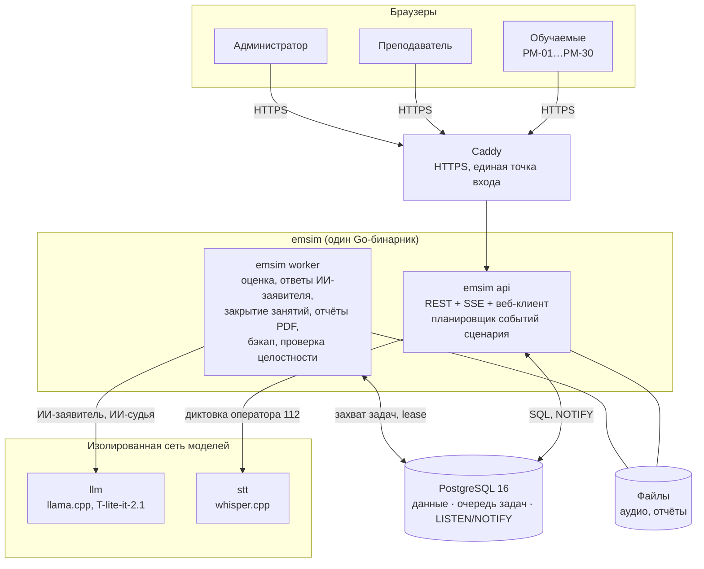

# EmSim — тренажёр диспетчеров экстренных служб

EmSim — локальный веб-тренажёр для учебного центра, который готовит персонал системы-112 и дежурно-диспетчерских служб (ДДС). Группа из 20–30 курсантов одновременно отрабатывает происшествия в интерфейсе, повторяющем АРМ-112. Преподаватель готовит задания, наблюдает занятие в реальном времени и получает автоматическую оценку каждого прохождения, которую может исправить. Система работает полностью офлайн на одном сервере без GPU.

| | |
|---|---|
| Репозиторий | https://github.com/DaleCoopTP/EmSim |
| Демо-стенд | https://emsim.evidlab.com (тестовая ВМ, может быть временно выключена) |
| Состояние документации | 29.09.2026 |

## Содержание

1. [Задача](#1-задача)
2. [Два упражнения](#2-два-упражнения)
3. [Роли и ход занятия](#3-роли-и-ход-занятия)
4. [Архитектура](#4-архитектура)
5. [Оценивание](#5-оценивание)
6. [Стек](#6-стек)
7. [Быстрый запуск](#7-быстрый-запуск)
8. [API](#8-api)
9. [Что реализовано и что в планах](#9-что-реализовано-и-что-в-планах)
10. [Структура репозитория](#10-структура-репозитория)
11. [Документация](#11-документация)

## 1. Задача

Сейчас диспетчеров обучают по бумажным билетам: без интерфейса рабочей системы, без контроля времени реакции и без объективной оценки. Ошибки диспетчера — отказ от профильного происшествия, пропущенный статус, неточный адрес, пустой комментарий — в реальной работе стоят времени реагирования.

EmSim решает это так:

- курсант работает в копии интерфейса АРМ-112 под серверными нормативами времени;
- события сценария (доклады бригады, входящие звонки, новые карточки) приходят по таймлайну, как в реальной смене;
- для оператора 112 заявителя играет локальная языковая модель; оператор может говорить с ним голосом через диктовку;
- после каждой карточки система сама считает оценку по рубрике, преподаватель её проверяет и при необходимости правит;
- данные не покидают учебный центр: модели работают на том же сервере.

## 2. Два упражнения

| | Оператор 112 (`operator112_intake`) | Диспетчер ДДС (`dds_processing`) |
|---|---|---|
| Кто обучается | оператор системы-112 | диспетчер ДДС района или скорой помощи (03) |
| Что на входе | входящий вызов заявителя | карточка происшествия, уже заполненная оператором 112 |
| Что делает обучаемый | отвечает на вызов, опрашивает заявителя (ИИ-заявитель или подготовленные вопросы), заполняет карточку, выбирает тип происшествия и профильные опросные карты (101, 103, 104), проверяет список служб и оповещает их одним действием | за 30 с ставит «Принята» / «Не принята», звонит руководителю бригады, по докладам бригады ведёт статусы «Начало реагирования» → «Прибытие» → «Проведение работ» → «Работы завершены» / «Отказ» с комментариями, отвечает на входящие звонки отдела контроля 112 |
| Чем оценивается | адрес, профильные карты, выясненные у заявителя сведения, время, содержание описания (ИИ-судья), штрафы за неверные службы и лишние карты | время открытия и первичного решения, правильность решения, реакция на доклады в срок, последовательность статусов, звонки, содержание комментариев (ИИ-судья), грамотность (справочно) |

У каждого упражнения свои сценарии, правила, рубрика и отчёты. Результаты ДДС и 112 не смешиваются ни в истории, ни в отчётах.

Подробно, со всеми экранами и действиями: [docs/user-guide.md](docs/user-guide.md).

## 3. Роли и ход занятия

| Роль | Что может |
|---|---|
| **Обучаемый** | входит с номером рабочего места (РМ); проходит назначенную очередь карточек; проходит ознакомительный тур по интерфейсу АРМ-112; видит свою историю и результаты |
| **Преподаватель** | ведёт каталог сценариев; создаёт сценарии 112 в веб-редакторе и проходит их сам в режиме предпросмотра; создаёт занятие и назначает очереди по РМ (вручную или случайной выборкой по разделам классификатора и уровню); настраивает нормативы, веса критериев и порог зачёта; следит за занятием в мониторе и останавливает его; разбирает и правит автооценку; выгружает отчёт (экран, CSV, PDF) |
| **Администратор** | пользователи (в том числе пакетная загрузка CSV), рабочие места, состояние системы, журнал аудита, отчёты использования и сбоев, резервные копии, проверка целостности, режим обслуживания. Доступа к занятиям, сценариям и оценкам не имеет |

Типичное занятие:

1. Преподаватель создаёт занятие, назначает сценарии на РМ и запускает его.
2. Обучаемые получают первые карточки. Сервер ведёт таймеры нормативов и по таймлайну сценария присылает события.
3. Преподаватель в мониторе видит, кто на какой карточке, статусы, таймеры, последнее действие и задержку реакции на доклады.
4. После закрытия карточки фоновый процесс считает автооценку.
5. Преподаватель разбирает оценки. Его исправление становится итоговым, история ревизий сохраняется. Затем он выгружает отчёт.

## 4. Архитектура

Модульный монолит на Go: один бинарник `emsim` с подкомандами `migrate`, `api`, `worker`, `bootstrap-admin`, `import` и служебными (`backup`, `restore`, `demo-setup`, `bench-llm`). PostgreSQL 16 хранит данные и одновременно служит очередью фоновых задач и шиной уведомлений. Веб-клиент (React) встроен в бинарник и раздаётся процессом `api`. Модели — отдельные контейнеры в изолированной сети без выхода в интернет.



Главные решения:

- **Сервер — источник истины.** Все действия обучаемого — идемпотентные команды одного эндпоинта с `command_id` и `expected_seq`. Повтор после обрыва сети не даёт второго эффекта, время и порядок определяет сервер.
- **PostgreSQL вместо брокера.** Доменное изменение, запись аудита, уведомление и постановка фоновой задачи фиксируются одной транзакцией.
- **Модель вне интерактивного пути.** Действия обучаемого никогда не ждут модель. Ответ ИИ-заявителя приходит асинхронной задачей, ИИ-судья работает после закрытия карточки.
- **Неизменяемый снимок прохождения.** Оценка считается по зафиксированному снимку (evidence), поэтому она воспроизводима, а правка преподавателя не стирает автооценку.
- **Остановка занятия — барьер.** Действие либо успело попасть в снимок до остановки, либо отклонено.

Подробно — модули, потоки команд и оценки, надёжность, безопасность: [docs/architecture.md](docs/architecture.md). Обоснование каждого решения — в [ADR](design-docs/adr/README.md).

## 5. Оценивание

После закрытия карточки фиксируется снимок прохождения и ставится задача оценки. Детерминированные критерии считает код. Проверку текста (описание со слов заявителя у 112, комментарии к статусам у ДДС) делает ИИ-судья по закрытым вопросам: он отвечает «да», «нет» или «нужна проверка», а баллы считает backend по рубрике.

- Модели не передаются эталон и рубрика — только проверяемый текст и вопросы.
- Если модель недоступна или не уверена, оценка получает статус «требует проверки» без балла, а не ноль. Ручная оценка возможна всегда, без модели.
- Рубрика фиксируется в занятии; её изменение не меняет уже проведённые занятия.

| Упражнение | Рубрика с ИИ-судьёй / без него | Порог зачёта |
|---|---|---|
| Оператор 112 | `operator112/rubric-v3` / `operator112/rubric-v2` | 70 из 100 (шесть блоков и четыре штрафа) |
| Диспетчер ДДС | `dds/rubric-v3` / `dds/rubric-v2` | 70 из 100 (меняется в настройках занятия) |

Критерии, веса и правила: [docs/assessment.md](docs/assessment.md).

## 6. Стек

| Слой | Технологии |
|---|---|
| Backend | Go 1.26, `net/http`, `pgx/v5`, `goose` (миграции), argon2id (пароли), `jsonschema` (проверка сценариев), `fpdf` (PDF), Prometheus |
| База данных | PostgreSQL 16: данные, очередь задач, `LISTEN/NOTIFY` |
| Веб-клиент | TypeScript, React 18, React Router, TanStack Query, Vite; без UI-кита, вёрстка повторяет АРМ-112; типы API генерируются из OpenAPI |
| Языковая модель | llama.cpp (`llama-server`, OpenAI-совместимый API), T-lite-it-2.1 8B (GGUF Q5_K_M); можно подключить удалённый OpenAI-совместимый API |
| Распознавание речи | whisper.cpp (`whisper-server`), модель `ggml-small` |
| Инфраструктура | Docker Compose, Caddy (HTTPS: внутренний CA для класса или Let's Encrypt для публичного стенда) |
| Наблюдаемость | JSON-логи `slog`, метрики Prometheus, `/healthz`, `/readyz`, экран «Состояние» |
| Тестирование | Go unit-тесты, интеграционные тесты на реальном PostgreSQL (testcontainers), Playwright e2e, проверка контрактов |

## 7. Быстрый запуск

Нужен Docker с Compose v2. Интернет нужен один раз — собрать образы и скачать веса моделей.

```bash
git clone https://github.com/DaleCoopTP/EmSim.git && cd EmSim
cp .env.example .env        # задать пароли администратора и БД
make model                  # веса языковой модели в ./models (один раз, ~5,4 ГБ)
make stt-model              # модель распознавания речи (один раз, ~465 МБ)
docker compose up --build
```

Приложение откроется на http://localhost:8080. Compose сам применит миграции, создаст администратора и загрузит каталог служб и сценариев из `seed/`.

Без моделей (быстрая проверка интерфейса; ИИ-заявитель заменяется заглушкой, ИИ-судья выключен):

```bash
docker compose -f compose.yaml -f compose.no-llm.yaml up --build
```

Демо-пользователи — преподаватель `instructor` и обучаемые `trainee01…trainee06` на `РМ-01…РМ-06`:

```bash
DEMO_PASSWORD=<пароль> make demo
```

Сервер класса с HTTPS в локальной сети — `make class-up`, публичный стенд — `make public-up`. Требования к серверу, все профили, переменные окружения, резервное копирование и обновление: [docs/deployment.md](docs/deployment.md).

## 8. API

REST/JSON с префиксом `/api/v1`, сессия в cookie, push-уведомления через SSE. Контракт — [design-docs/contracts/openapi.yaml](design-docs/contracts/openapi.yaml) (OpenAPI 3.1): 80 операций, из них 70 реализованы, 10 зарезервированы под запланированные возможности.

| Группа | Основные пути | Роль |
|---|---|---|
| Вход | `POST /auth/login`, `POST /auth/logout`, `GET /me`, `POST /me/password` | все |
| Сценарии | `/scenarios`, `/scenarios/{id}`, `/versions`, `/validate`, `/approve`, `/preview-runs` | преподаватель |
| Занятия | `/lessons`, `/lessons/{id}/assignments`, `/start`, `/stop`, `/monitor`, `/stream` (SSE) | преподаватель |
| Рабочее место | `/my/run`, `/my/items`, `/items/{id}`, `POST /items/{id}/actions`, `POST /items/{id}/dictation`, `/my/stream` (SSE) | обучаемый |
| Оценка и отчёты | `/items/{id}/assessment`, `/assessment/revisions`, `/lessons/{id}/report(.csv/.pdf)`, `/my/results` | преподаватель, обучаемый |
| Администрирование | `/admin/users`, `/admin/workstations`, `/admin/status`, `/admin/audit`, `/admin/usage`, `/admin/backup`, `/admin/integrity`, `/admin/maintenance` | администратор |

Командный протокол, SSE, коды ошибок и список нереализованных операций: [docs/api.md](docs/api.md).

## 9. Что реализовано и что в планах

**Реализовано**

- Оператор 112: входящий вызов, карточка с нуля; опрос заявителя подготовленными вопросами и свободный диалог с ИИ-заявителем; диктовка реплик голосом; типы происшествия и профильные карты 101, 103, 104 с автоматическим подбором служб; единое действие «Оповестить и сохранить»; веб-редактор сценариев с проверкой и предпросмотром.
- Диспетчер ДДС: цикл статусов реагирования по памятке ДДС; связь с бригадой, доклады и входящие звонки по таймлайну; настройка занятия — нормативы, веса, порог, случайная выдача.
- Оценивание: детерминированные рубрики обоих упражнений, ИИ-судьи текста, экспертные ревизии, отчёты (экран, CSV, PDF), история обучаемого.
- Платформа: занятия, очереди по РМ, монитор, остановка, восстановление после перезапуска, ознакомительный тур по интерфейсу, роль администратора, резервные копии, проверка целостности, профили развёртывания.
- Каталог: 30 активных сценариев (16 ДДС и 14 оператора 112).
- Проверки: 649 unit-тестов Go, 134 интеграционных теста на реальном PostgreSQL, 10 e2e-сценариев в браузере.

**Ограничения и планы**

- Замер нагрузки на 8 vCPU показал, что такой сервер не держит целый класс с ИИ-заявителем: ответ заявителя — около 12 с при одном диалоге и около 46 с при восьми. Замер на 16 vCPU, модель меньше или GPU ещё впереди.
- Профильные карты, правила подбора служб, эталоны сценариев и рубрики ещё не прошли экспертную приёмку заказчика.
- В планах: голосовой звонок с озвучкой заявителя, взаимодействие 112 ↔ ДДС, рекомендация уровня и графики прогресса, редактор и ИИ-генерация сценариев ДДС, нагрузочный прогон класса, офлайн-пакет с моделями.

Полный перечень с деталями и цифрами замеров: [docs/status.md](docs/status.md).

## 10. Структура репозитория

| Путь | Что там |
|---|---|
| `cmd/emsim/` | точка входа и сборка приложения из модулей |
| `internal/` | модули: `auth`, `content`, `training`, `assessment`, `reporting`, `media`, `platform` |
| `migrations/` | миграции PostgreSQL (только вперёд) |
| `web/` | веб-клиент React ([web/README.md](web/README.md)) |
| `seed/` | службы, классификатор, каталог 112 и сценарии ([seed/README.md](seed/README.md)) |
| `test/integration/` | интеграционные тесты на реальном PostgreSQL и процессах `api`/`worker` |
| `design-docs/` | RFC, ADR, контракты, диаграммы ([design-docs/README.md](design-docs/README.md)) |
| `docs/` | документация проекта и референсы интерфейса АРМ-112 |
| `deploy/`, `scripts/`, `compose*.yaml` | профили развёртывания, резервное копирование, обновление, загрузка моделей |

## 11. Документация

| Документ | Для чего |
|---|---|
| [docs/user-guide.md](docs/user-guide.md) | руководство по ролям: обучаемый ДДС и 112, преподаватель, администратор; сценарий показа |
| [docs/architecture.md](docs/architecture.md) | модули, процессы, потоки команд и оценки, надёжность, безопасность |
| [docs/assessment.md](docs/assessment.md) | рубрики, критерии, ИИ-судьи, ревизии |
| [docs/deployment.md](docs/deployment.md) | установка, профили, модели, настройки, резервные копии, обновление |
| [docs/api.md](docs/api.md) | API, командный протокол, SSE, ошибки |
| [docs/development.md](docs/development.md) | сборка, тесты, проверки, соглашения по коду |
| [docs/status.md](docs/status.md) | что реализовано, ограничения, результаты замеров, план |
| [seed/README.md](seed/README.md) | состав и формат сценариев, загрузка каталога |
| [web/README.md](web/README.md) | устройство веб-клиента |
| [design-docs/README.md](design-docs/README.md) | исходный технический дизайн (RFC), 37 архитектурных решений (ADR), контракты, диаграммы |
| [docs/reference-ui/README.md](docs/reference-ui/README.md) | снимки и разбор интерфейса АРМ-112, по которым сделана вёрстка |
