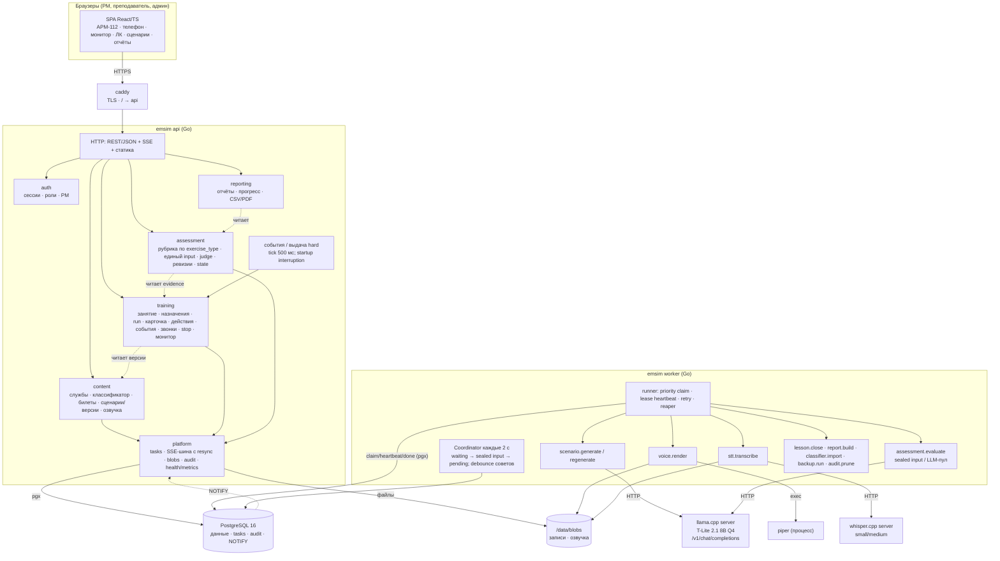

# Контекст и компоненты

Две схемы: границы системы (кто снаружи) и компоненты внутри (что с чем говорит и по какому протоколу). Обе — про решения ADR-001/002/003: один бинарник с процессами api/worker, одна БД, модели за worker'ом.

## Контекст

```
                 ┌────────────┐   ┌──────────────┐   ┌───────────────┐
                 │ Обучаемый  │   │ Преподаватель│   │ Администратор │
                 │ РМ-01…РМ-30│   │  свой ПК     │   │               │
                 └─────┬──────┘   └──────┬───────┘   └──────┬────────┘
                       │ HTTPS: REST + SSE (браузер)        │
                       ▼                 ▼                  ▼
                 ╔═════════════════════════════════════════════════╗
                 ║                    EmSim                        ║
                 ║  тренажёр ДДС · один сервер · локальная сеть    ║
                 ╚═════════════════════════════════════════════════╝
                       │                  │                 │
                 ┌─────▼─────┐     ┌──────▼──────┐   ┌──────▼──────┐
                 │ Классифи- │     │ 96 билетов  │   │ Памятка     │
                 │ катор XLSX│     │ (docx/txt)  │   │ АРМ-112     │
                 │ (импорт)  │     │ (импорт)    │   │ (ссылки в   │
                 └───────────┘     └─────────────┘   │  подсказках)│
                                                     └─────────────┘
       Снаружи НЕТ: системы-112, SIP-АТС, интернета, внешних IdP, облачных моделей.
```

## Компоненты



## Что фиксирует схема (и что нельзя нарушать)

| Правило | Где видно |
|---|---|
| Браузер говорит только с `api` (через caddy); к моделям и БД доступа нет | единственная стрелка из `browser` |
| `api` не вызывает модели; `worker` не обслуживает HTTP | стрелки к LLM/STT/TTS только из `worker` |
| `api` и `worker` не общаются напрямую — только через `tasks` и `NOTIFY` в PostgreSQL | нет ребра api ↔ worker |
| Модули внутри `api` зависят в одну сторону: content ← training ← assessment ← reporting; все → platform | пунктирные «читает» |
| Планировщик событий живёт в `api` (ему нужна SSE-шина с resync в том же процессе), а не в worker | `SCHED` внутри `api` |
| Бинарники — файлы; БД хранит только метаданные | `FS` отдельно от `PG` |

## Топология поставки (compose, профиль `class`)

```
docker network: emsim (internal)                публикуется наружу
┌───────────────────────────────────────────┐   ┌──────────────┐
│ postgres  api  worker  llm  stt           │◄──│ caddy :443   │
│ volumes: pgdata  blobs  models            │   └──────────────┘
└───────────────────────────────────────────┘
профиль demo: то же на ноутбуке, модель поменьше; профиль gpu: llm с --n-gpu-layers
```

## Уточнения ADR-014/015/016

NOTIFY вызывается внутри транзакции эффекта; после потери LISTEN клиентам требуется resync. Короткие задачи и LLM/STT имеют независимые лимиты; число одновременных inference определяется замерами 1/2/4, а не количеством РМ. Схема показывает процессы; детальные границы фиксации входов и результатов — в RFC §7–8.

Первый этап — dds_processing; будущий operator112_intake использует те же общие механизмы и отдельные правила/рубрику. В training правила ДДС изолированы в training/dds. На клиенте одна команда на item в localStorage, аудио в памяти. В БД один assessment_inputs с правилами и текстами STT; trainee_assessment_state принадлежит assessment. Планировщик не обновляет heartbeat занятия.
