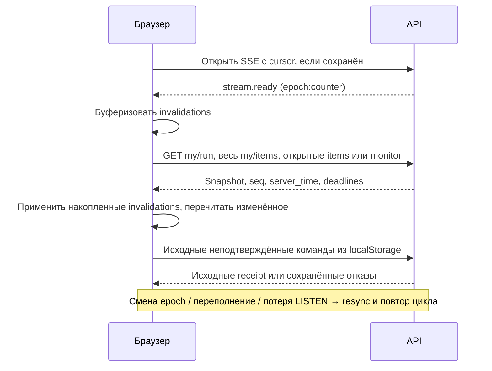

# Последовательности согласованных потоков

Уточнены по RFC §7–8 и ADR-014/015/016, 18 сентября 2026. Источник контракта — RFC и исполняемые схемы.

## S1. Команда и потерянный ответ

```mermaid
sequenceDiagram
  participant B as Браузер
  participant A as API
  participant DB as PostgreSQL
  B->>B: Исходная команда в localStorage
  B->>A: POST actions с command_id и expected_seq
  A->>A: Авторизация и принадлежность item
  A->>DB: BEGIN; lessons SHARE → items UPDATE; поиск command_id
  alt известный command_id
    A->>A: Сверить автора, item, request_digest
    A-->>B: Исходный HTTP/outcome; replayed=true
  else новая команда
    A->>A: running/closed, expected_seq, workflow
    A->>DB: clock_timestamp; action_id/log_seq; seq растёт только при applied
    A->>DB: Эффект или отказ + audit + NOTIFY; COMMIT
    A-->>B: Receipt; replayed=false
  end
  Note over B,DB: Replay работает после stop/close; другое тело под тем же id запрещено
```

## S2. Событие и запись звонка

```mermaid
sequenceDiagram
  participant B as Браузер
  participant A as API / scheduler
  participant DB as PostgreSQL
  B->>A: Первое accepted
  A->>DB: anchor_at; due_at=anchor+at_s без сдвига при restart
  Note over A,DB: status_in проверяется при доставке, не запускает отсчёт
  A->>DB: lessons SHARE → item UPDATE → event UPDATE; повторная проверка
  A->>DB: delivered/skipped + NOTIFY; COMMIT
  A-->>B: Событие, текст и готовое аудио
  B->>A: call_start
  B->>B: greeting; запись в памяти; завершить; ack
  B->>A: call_end: поля отработки + hash/размер/MIME записи
  A->>DB: Неизменяемый манифест ожидаемого файла
  B->>A: PUT recording, в том числе после close до upload deadline
  A->>A: Проверить фактический hash/размер/MIME
  A->>DB: Проверенный blob; STT только после close
  Note over B,DB: Тот же файл — успех; замена и новый файл после срока — отказ
```

## S3. Закрытие, подготовка входа и ручная оценка

```mermaid
sequenceDiagram
  participant A as API
  participant DB as PostgreSQL
  participant C as Worker coordinator
  participant S as STT-пул
  participant W as LLM-пул
  A->>DB: close после терминального статуса; evidence/interruption/cutoff
  A->>DB: evaluate waiting только training; STT dependencies; следующая карточка; COMMIT
  S->>S: STT загруженного файла после close
  S->>DB: Текст и provenance в tasks.result + done (fencing)
  C->>DB: Poll waiting каждые 2 с; upload deadline либо терминальный STT
  C->>DB: Рубрика по exercise_type/version + правила + тексты → assessment_inputs
  C->>DB: sealed input + evaluate pending атомарно
  alt автоматика завершается первой
    W->>DB: Claim priority 100; читать sealed input
    W->>W: Модель вне транзакции
    W->>DB: Item lock → task lock; lease/token; expert отсутствует
    W->>DB: auto rev=1 + done либо needs_review + terminal failure
  else преподаватель оценивает до автоматики
    A->>DB: Проверить base=0 под item lock; expert rev=2, input может быть NULL
    A->>DB: Отменить evaluate; сменить basis_version; COMMIT
    W->>DB: Finalize видит cancelled/expert и не пишет auto
  end
  Note over A,W: needs_review → score/passed NULL; ручная оценка доступна и при провале подготовки
  Note over C,S: STT result удерживается до seal/отмены; нет общего deadline очереди 180 с
```

## S4. Stop и поздние действия

```mermaid
sequenceDiagram
  actor I as Преподаватель
  participant A as API
  participant DB as PostgreSQL
  participant F as Короткий пул
  participant B as Браузер
  I->>A: POST stop
  A->>DB: lessons UPDATE; stopped_at, epoch, items.stop_cutoff_log_seq
  A->>DB: lesson.close + audit + NOTIFY; COMMIT
  A-->>I: Остановка подтверждена
  B->>A: Повтор известного command_id
  A-->>B: Исходная квитанция; replayed=true
  B->>A: Новая учебная команда
  A->>DB: Отказ в журнале вне cutoff
  A-->>B: 409 lesson_stopped
  F->>DB: items interrupted; closed_at=stopped_at; отмена событий; evidence
  F->>DB: evaluate waiting только training; runs/lesson finished
  B->>A: control_report по закрытой карточке
  A->>DB: Отдельное сообщение; evidence и оценка не меняются
```

## S5. Генерация и повтор фоновой задачи

```mermaid
sequenceDiagram
  actor I as Преподаватель
  participant A as API
  participant DB as PostgreSQL
  participant W as Worker
  I->>A: Сгенерировать сценарий
  A->>DB: Task с dedup_key
  A-->>I: 202 task_ids
  W->>DB: Claim; worker/token
  W->>W: Модель и валидация вне транзакции
  W->>DB: Доменный lock → task lock; проверить lease
  W->>DB: Version с UNIQUE source_task_id + done + NOTIFY; COMMIT
  Note over W,DB: Потерянный lease запрещает эффект; commit даёт всё либо ничего
  I->>A: Проверить, исправить новой версией, утвердить
  A->>DB: Утверждение и voice.render
```

## S6. Переподключение



## S7. Перезапуск API и hard-очередь

```mermaid
sequenceDiagram
  participant A as Новый API
  participant DB as PostgreSQL
  participant B as Браузер
  A->>DB: До readiness: открытые running items → interruption(recovery_id)
  A->>DB: COMMIT; без переноса due_at/deadlines
  A-->>B: resync; timing затронутых карточек не оценивается
  A->>DB: Scheduler: overdue сообщения по due_at, late=true
  A->>DB: Due run: lessons SHARE → run UPDATE → items UPDATE
  A->>DB: Выдать одну карточку; queue_cursor++; next_offer_at=offered_at+interval
  Note over A,DB: Без пачки пропущенных интервалов; close в hard не ускоряет выдачу
```
