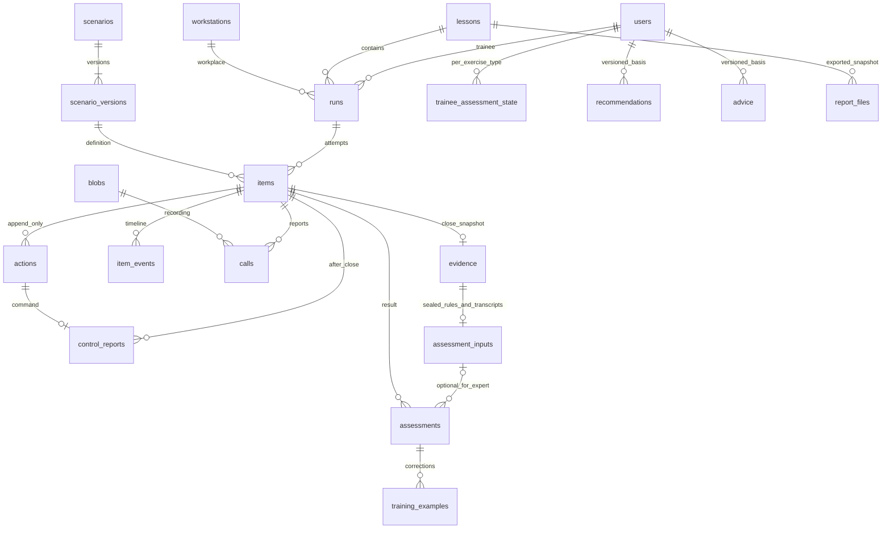

# Данные и инварианты

Исполняемая схема — [schema.sql](../contracts/schema.sql). Ниже ключевые связи после ADR-014/015/016; справочники и часть колонок опущены.

| Объект | Колонки и гарантия |
|---|---|
| users | текущий level; версии оценки здесь нет |
| trainee_assessment_state | PK(user_id,exercise_type), version, advice_due_at; владелец assessment |
| scenario_versions | exercise_type/body/digest/difficulty этой версии; source_task_id UNIQUE |
| lessons | exercise_type/timing/rubric_version, stopped_at, recording_grace_s |
| runs | exercise_type, level_at_start, next_offer_at; queue_cursor меняется под блокировкой run |
| items | seq версии состояния, log_seq всех попыток; primary_at первого решения; timing_effective/deadlines, interruptions, stop_cutoff_log_seq |
| actions | action_id, log_seq, command_id UNIQUE, actor_id, request_digest, исходные receipt/http_status; server_at после lock |
| item_events | anchor_at/due_at; UNIQUE(item,event_key); CHECK state/delivered_at/skip_reason |
| calls | объявленный hash/размер/MIME, recording_state/upload deadline; live transcript отсутствует |
| evidence | Снимок до cutoff_log_seq, exercise_type/timing/deadlines/interruptions/stop; поздние действия отдельно |
| assessment_inputs | Единый неизменяемый JSON: exercise_type, правила, рубрика, тексты STT/hash/model/parameters либо причины отсутствия, вход judge |
| assessments | UNIQUE(item,revision), одна auto revision=1; expert с base_revision/reason (base=0 → rev=2 без auto/input); source_task_id для auto |
| control_reports | Сообщение после close, связано с командой, не меняет evidence |
| tasks | waiting без attempts, pending/leased/terminal/cancelled; priority, dependency_task_ids; STT временно в result до seal; fenced общая фиксация домена и done |
| recommendations / advice | basis_version; конкретные итоговые ревизии вместо часового dedup |
| report_files | Файл + basis с использованными ревизиями и временем формирования |

## Вопросы ревью

| Вопрос | Ответ |
|---|---|
| Как повторить после stop | Принадлежность и поиск command_id до running для новых команд |
| Как сослаться на ошибочную попытку | action_id; seq может совпадать, log_seq уникален |
| Как пережить сбой worker | Эффект + done + audit + NOTIFY атомарны с fencing; уникальный результат |
| Почему поздняя запись не меняет evidence | Hash объявлен заранее; производный текст хранится отдельно и фиксируется во входе |
| Как преподаватель сохраняет приоритет | Последняя expert, иначе одна auto; recompute в MVP нет |
| Откуда исторические уровень и сложность | runs.level_at_start и scenario_versions.difficulty |
| Почему stop не добавляет ожидание worker | closed_at=stopped_at, cutoff фиксируется на барьере |
| Почему старый совет не остаётся актуальным | Новая basis_version после правки/смены уровня |

Индексы: claim pending, ожидание waiting, lease expiry; items(run,state), actions(item,log_seq), events(due_at) WHERE scheduled, assessments(item,revision), сценарии по службе/сложности. Evidence, actions, sealed inputs и ревизии защищены от UPDATE/DELETE. DDL не заменяет конкурентных acceptance-тестов будущего приложения.

Текущие контракты принимают только dds_processing; будущий 112 получит свой вариант состояния/команд/рубрики. needs_review имеет NULL score/passed. Физических таблиц call_transcripts/assessment_rule_results нет: содержание хранится внутри assessment_inputs.
