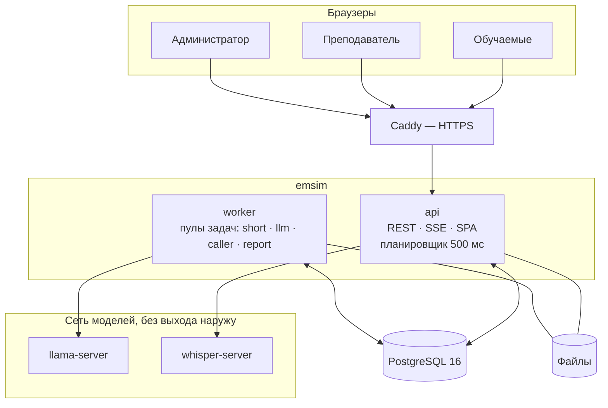
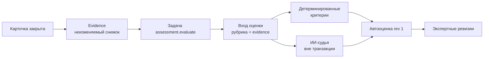

# Архитектура EmSim

Документ описывает, как устроена система сейчас. Обоснование каждого решения — в [ADR](../design-docs/adr/README.md); исходный технический дизайн — в [RFC-001](../design-docs/rfc-001-emsim.md).

## 1. Обзор

EmSim — модульный монолит на Go. Весь код поставляется одним бинарником `emsim`; роль процесса задаёт подкоманда:

| Подкоманда | Назначение |
|---|---|
| `migrate` | применить миграции PostgreSQL |
| `bootstrap-admin` | создать первую учётную запись администратора (идемпотентно) |
| `import` | загрузить службы, классификатор, каталог 112 и сценарии из `seed/` |
| `api` | HTTP API, SSE-потоки, раздача веб-клиента, планировщик событий сценария |
| `worker` | фоновые задачи: закрытие занятий, оценка, ответы ИИ-заявителя, PDF, бэкап, обслуживание |
| `backup`, `restore` | резервная копия и восстановление |
| `demo-setup` | демо-пользователи и рабочие места |
| `bench-llm` | стенд замера производительности модели |



`api` и `worker` не обращаются друг к другу напрямую. Они обмениваются данными только через PostgreSQL: `api` ставит задачу в той же транзакции, что и доменное изменение, `worker` её забирает. `api` также отправляет `NOTIFY` и по нему рассылает SSE-уведомления браузерам.

Контейнеры модели и распознавания речи работают во внутренней сети `inference` без опубликованных портов и без выхода в интернет. Наружу опубликован только Caddy (в демо-профиле — порт `api` на `127.0.0.1`).

## 2. Модули

Код разделён на продуктовые модули в `internal/`. Правила:

- модуль пишет только в свои таблицы;
- чужие данные читаются через узкие интерфейсы, объявленные у модуля-потребителя;
- циклических зависимостей нет;
- сборка модулей в приложение — только в `cmd/emsim`.

| Модуль | Отвечает за | Основные таблицы |
|---|---|---|
| `auth` | пользователи, сессии, роли, рабочие места, политика входа | `users`, `sessions`, `workstations` |
| `content` | справочник служб и их workflow статусов, классификатор, каталог 112 (типы, профильные карты, правила подбора служб), сценарии и их неизменяемые версии, редактор сценариев 112 | `services`, `classifier_types`, `scenarios`, `scenario_versions` |
| `training` | занятия, назначения, прохождения, карточки, команды обучаемого, события по таймлайну, звонки, остановка, монитор | `lessons`, `assignments`, `runs`, `items`, `actions`, `item_events`, `calls`, `evidence` |
| `assessment` | рубрики, конвейер автооценки, ИИ-судьи, экспертные ревизии | `assessment_inputs`, `assessments` |
| `reporting` | отчёты по занятию, история обучаемого, CSV, PDF, отчёты использования | `report_files` и представления |
| `media` | аудиофайлы: подготовленные реплики, записи звонков | — |
| `platform` | очередь задач, SSE, аудит, HTTP, метрики, резервные копии, целостность, клиенты LLM и STT | `tasks`, `blobs`, `audit_log` |

Правила двух упражнений изолированы в собственных пакетах:

| | Правила прохождения | Критерии оценки |
|---|---|---|
| Диспетчер ДДС | `internal/training/dds` | `internal/assessment/dds` |
| Оператор 112 | `internal/training/operator112` | `internal/assessment/operator112` |

Общими остаются транзакции, авторизация, протокол команд, журнал, остановка и восстановление, конвейер оценки и отчётность. Тип упражнения (`exercise_type`) фиксируется в версии сценария, занятии и прохождении и не меняется после старта.

Внутри модулей — прагматичная гексагональная структура: доменные правила не зависят от HTTP, SQL, файлов и моделей; прикладные сервисы управляют сценариями использования и транзакциями; инфраструктура (`postgres/`, `http/`, адаптеры моделей) реализует узкие порты.

## 3. Команда обучаемого

Все действия обучаемого на карточке — команды одного эндпоинта `POST /api/v1/items/{id}/actions`:

```json
{"command_id": "…uuid…", "expected_seq": 7, "type": "set_status", "payload": {"status": "accepted", "comment": "…"}, "client_at": "…"}
```

```mermaid
sequenceDiagram
    participant B as Браузер
    participant API as emsim api
    participant DB as PostgreSQL
    B->>B: сохранить команду в localStorage
    B->>API: POST /items/{id}/actions
    API->>DB: BEGIN; lessons FOR SHARE; items FOR UPDATE
    alt command_id уже есть
        DB-->>API: исходная квитанция
    else новая команда
        API->>DB: проверить состояние, expected_seq, правила упражнения
        API->>DB: INSERT actions; UPDATE items; audit; задачи; pg_notify
    end
    API->>DB: COMMIT
    API-->>B: квитанция {outcome, seq, item_state}
    DB-->>API: NOTIFY → SSE монитору преподавателя
```

Гарантии:

- **Идемпотентность.** Повтор того же `command_id` возвращает исходную квитанцию и исходный HTTP-статус без второго эффекта. Тот же `command_id` с другим телом — `409 command_id_conflict`.
- **Оптимистическая блокировка.** Устаревший `expected_seq` (например, из второй вкладки) отклоняется, отказ тоже записывается в журнал.
- **Серверное время.** Время действия берётся после получения блокировок (`clock_timestamp()`), порядок — по номеру в журнале, а не по часам клиента.
- **Одна неподтверждённая команда на карточку** хранится в `localStorage` и повторяется с тем же `command_id` после перезагрузки вкладки.

Интерактивные команды — короткие транзакции API. Через очередь идут только долгие операции: ответ модели, закрытие занятия, оценка, PDF.

## 4. Таймлайн и нормативы

Сценарий описывает события: доклады бригады, входящие звонки, новые карточки. Событие планируется при первом наступлении своего якоря (выдача карточки, статус, завершение звонка конкретному контакту) и доставляется через `at_s` секунд, если условие `status_in` выполнено.

Планировщик в `api` каждые 500 мс выбирает созревшие события и доставляет каждое отдельной короткой транзакцией под теми же блокировками, что и команды. Нормативы ДДС (по умолчанию: открыть карточку за 30 с, первичное решение за 30 с, отработка за 180 с) фиксируются при старте занятия; превышение фиксируется для оценки, но карточку не закрывает.

## 5. Остановка и восстановление

- **Остановка занятия — барьер.** Под блокировкой занятия фиксируются `stopped_at` и номер последнего действия каждой открытой карточки. Команды после барьера отклоняются. Закрытие оставшихся карточек выполняет задача `lesson.close`.
- **Перезапуск сервера.** До готовности `api` помечает открытые карточки идущих занятий отметкой прерывания. Их временные критерии не оцениваются, просроченные события доставляются с отметкой `late`.
- **Переподключение браузера.** SSE — только уведомление. Клиент открывает поток, получает курсор, перечитывает состояние через API и применяет накопившиеся события. Неизвестный курсор приводит к `resync`.

## 6. Оценка



1. Закрытие карточки в той же транзакции создаёт снимок прохождения (evidence) с дайджестом и ставит задачу `assessment.evaluate`.
2. Worker фиксирует вход оценки: снимок, действующую рубрику с поправками занятия и сценария.
3. Если в рубрике есть ИИ-критерии, worker вне транзакции задаёт модели закрытые вопросы. Ошибка модели — повторяемый сбой задачи.
4. Одной транзакцией записывается автооценка (ревизия 1), завершается задача, пишется аудит.
5. Ревизия преподавателя становится итоговой. Поздняя автооценка её не перекрывает.

Подробно о рубриках — [assessment.md](assessment.md).

## 7. Фоновые задачи

Очередь задач построена на PostgreSQL (`SELECT … FOR UPDATE SKIP LOCKED`) и унаследована из проекта orchestration-core ([ADR-010](../design-docs/adr/010-reuse-core-queue-by-copy.md)):

- выполнение at-least-once с lease по часам PostgreSQL и fencing-токеном: исполнитель, потерявший lease, не может записать результат;
- доменный эффект и завершение задачи фиксируются одной транзакцией;
- ограниченное число повторов с нарастающей паузой, затем `failed` или `dead_letter`; администратор может повторить задачу с экрана «Состояние».

| Пул | Задачи |
|---|---|
| `short` | `lesson.close`, `audit.prune` (очистка журнала аудита) |
| `llm` | `assessment.evaluate` (оценка, включая ИИ-судью) |
| `caller` | `caller.reply` (ответ ИИ-заявителя), `caller.warmup` (прогрев кэша промпта) |
| `report` | PDF-отчёты, `backup.run` (резервная копия), `integrity.check` (проверка целостности) |

Отдельно от пулов в worker работают координатор зависимостей оценки (раз в 2 с переводит готовые задачи оценки из ожидания в очередь) и планировщик ежедневного обслуживания.

Лимиты параллелизма пулов задаются переменными `LLM_CONCURRENCY`, `CALLER_CONCURRENCY`, `REPORT_CONCURRENCY` ([deployment.md](deployment.md)).

## 8. Модели

| Где используется | Когда вызывается | Что получает модель |
|---|---|---|
| ИИ-заявитель (112) | задача `caller.reply` после каждой реплики оператора, вне транзакции команды | персонаж, факты сценария, уже раскрытые факты, историю разговора. Эталон карточки, рубрику и набор служб модель не получает |
| ИИ-судья описания (112) | при оценке закрытой карточки | текст поля «Описание со слов заявителя» и контрольные вопросы сценария |
| ИИ-судья комментариев (ДДС) | при оценке закрытой карточки | комментарии к статусам и вопросы, построенные из эталона |
| Диктовка (112) | `POST /items/{id}/dictation`, вне транзакции, без эффекта на карточку | аудио одной фразы; ни аудио, ни текст не сохраняются |

Какие факты заявитель может раскрыть, решает детерминированный классификатор по шаблонам вопросов сценария; модель только формулирует ответ. Если модель не ответила за `CALLER_REPLY_TIMEOUT`, задача повторяется, а на последней попытке заявитель произносит нейтральную фразу — чат не останавливается.

Без моделей система полностью работоспособна: ИИ-заявитель заменяется заглушкой, ИИ-критерии не включаются в рубрику нового занятия, диктовка скрыта.

## 9. Безопасность

- Вход по логину и паролю (argon2id), номер рабочего места для обучаемого. Сессия в cookie `HttpOnly`, `SameSite=Strict`, `Secure` за HTTPS, хранится в БД.
- Политика входа: блокировка после серии неверных паролей, минимальная длина, обязательная смена пароля, выданного администратором.
- Роли проверяются на маршруте, принадлежность данных — в обработчике: обучаемый видит только свои прохождения, преподаватель — свои занятия и черновики. Администратор не видит занятий, сценариев и оценок.
- Эталоны, скрытые факты заявителя, будущие реплики и дерево диалога никогда не отдаются обучаемому.
- Каждое изменение пишется в журнал аудита в той же транзакции. Логи не содержат паролей, текстов комментариев, реплик и ФИО.
- Внешний сервис модели подключается только явным профилем `compose.remote-llm.yaml`.

## 10. Наблюдаемость

- JSON-логи `slog` с `request_id`, пользователем, операцией и кодом результата.
- Метрики Prometheus на служебных портах (`:8081` у `api`, `:8082` у `worker`): HTTP, команды, задачи, планировщик, SSE.
- `/healthz` — процесс жив; `/readyz` — база доступна и схема нужной версии.
- Экран администратора «Состояние»: нагрузка, очередь задач, упавшие задачи, резервные копии, целостность, режим обслуживания.

## 11. Схемы и контракты

| Материал | Где |
|---|---|
| Компоненты и границы | [design-docs/diagrams/01-context-components.md](../design-docs/diagrams/01-context-components.md) |
| Последовательности критических сценариев | [design-docs/diagrams/02-sequences.md](../design-docs/diagrams/02-sequences.md) |
| ER-диаграмма | [design-docs/diagrams/03-er.md](../design-docs/diagrams/03-er.md) |
| OpenAPI, DDL, JSON-схемы, рубрики | [design-docs/contracts/](../design-docs/contracts/) |
