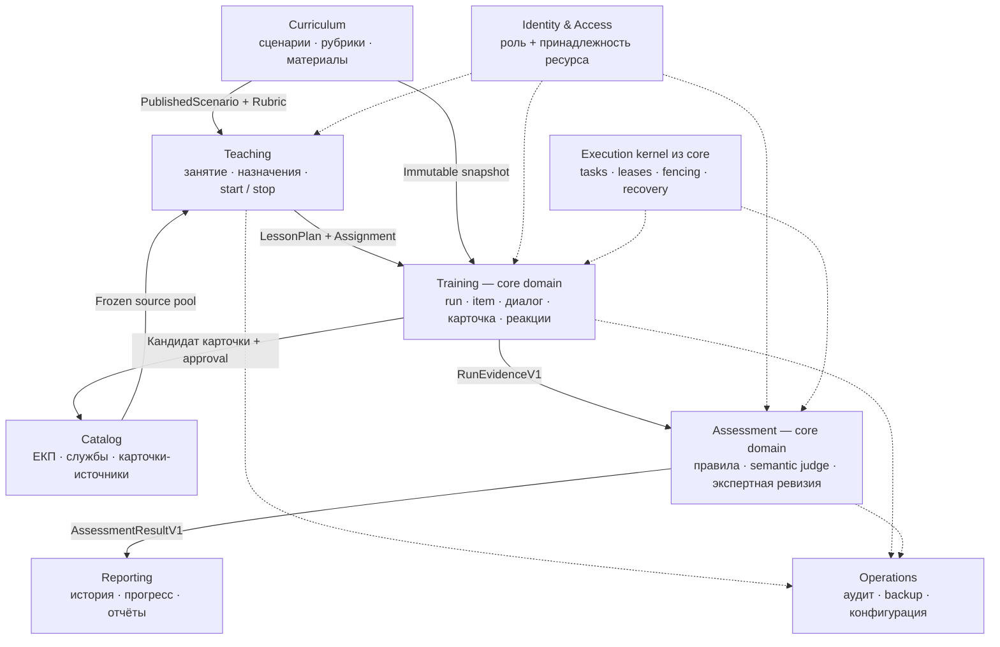
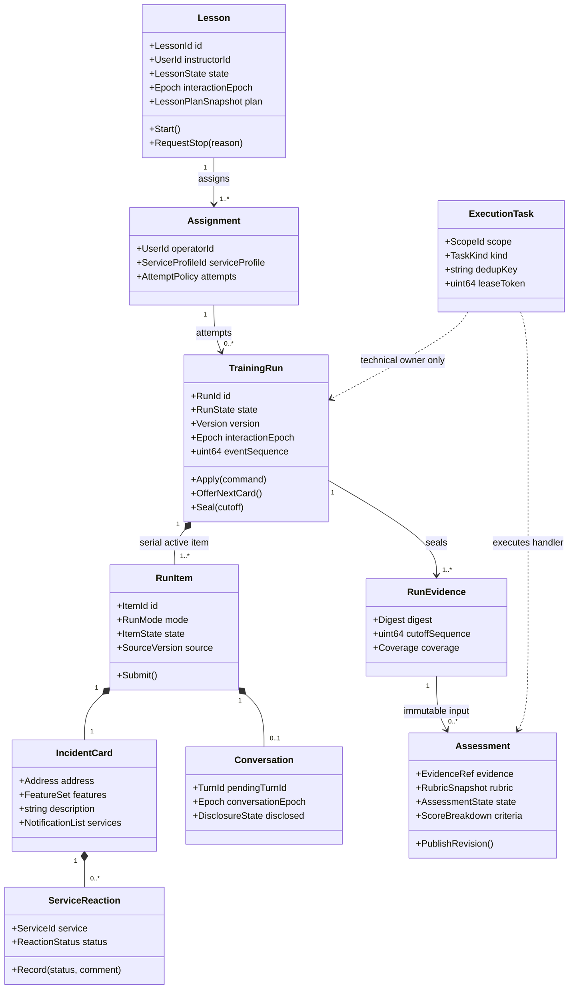
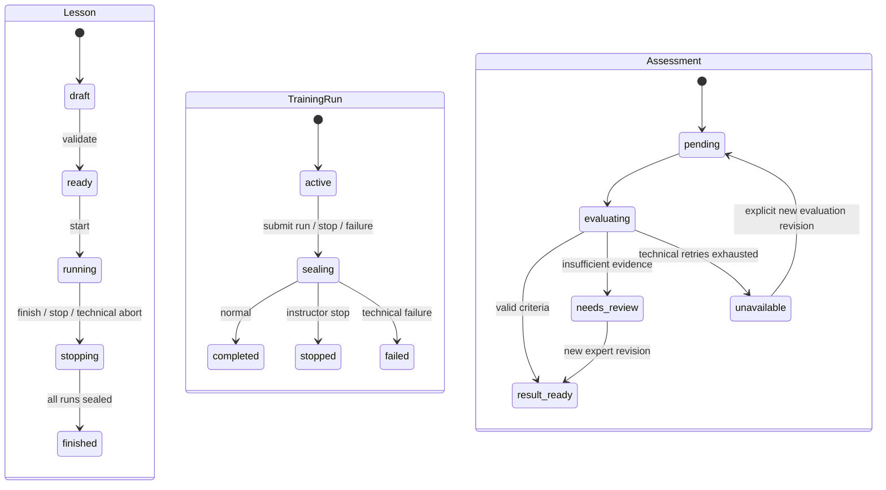
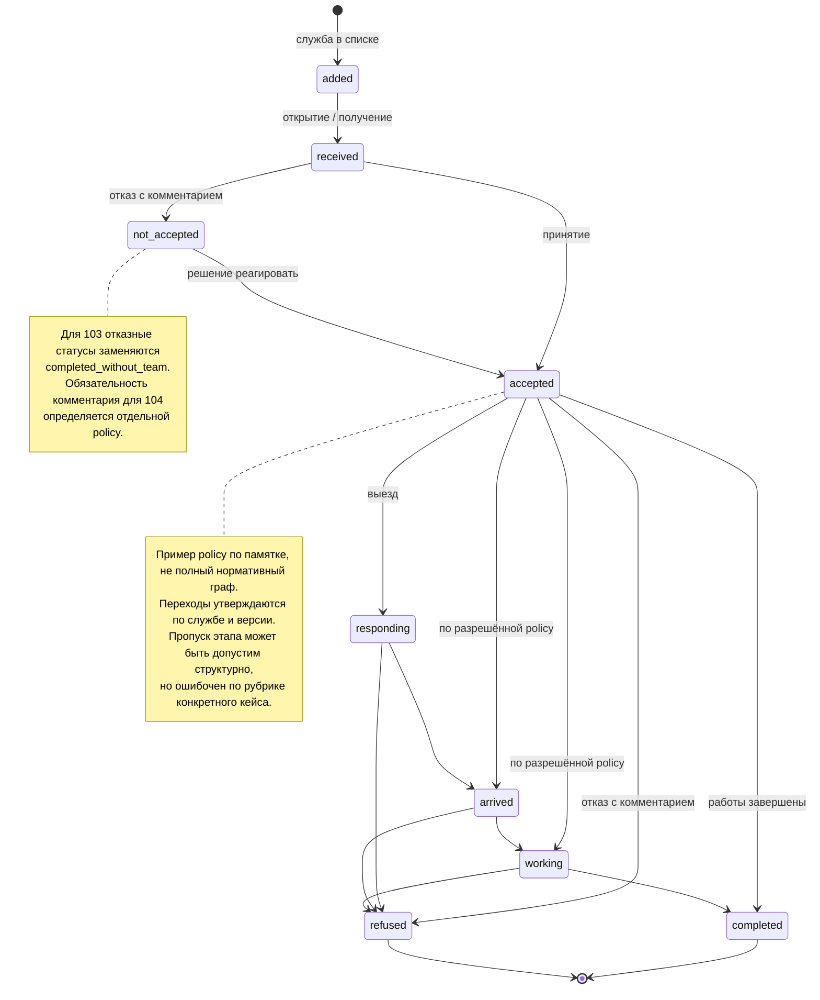

# UML и последовательности

Редактируемые схемы Mermaid; исходники лежат в `diagrams/*.mmd`. Это целевая модель. Полные правила и ограничения находятся в спецификации.

## Карта контекстов



## Агрегаты и отношения



## Задача 1: один интерактивный ход

```mermaid
sequenceDiagram
  actor O as Оператор
  participant UI as Browser + IndexedDB
  participant API as Training API
  participant DB as PostgreSQL
  participant W as Turn worker
  participant L as Local CallerSimulator
  O->>UI: Реплика / заполнение карточки
  UI->>UI: Сохранить command_id и intent
  UI->>API: POST command, expected_version, epoch
  API->>DB: BEGIN; lesson SHARE; run UPDATE; dedup
  API->>DB: Message/action + audit + event + turn task + receipt
  API->>DB: COMMIT
  API-->>UI: ACK(version, sequence)
  W->>DB: Claim task, lease token; read frozen input
  W->>L: Generate one turn (вне DB transaction)
  L-->>W: Text + disclosed fact IDs
  W->>DB: BEGIN; check lesson/run epoch + turn + lease
  alt Ещё активен и lease актуален
    W->>DB: Message + task done + event + outbox; COMMIT
    DB-->>API: Wakeup hint / poll
    API-->>UI: SSE persisted event(sequence)
    UI-->>O: Реплика заявителя
  else Stop или lease lost
    W->>DB: Rollback effect; cancel/reconcile
  end
  Note over W,L: Во время ожидания человека worker свободен
```

## Остановка преподавателем

```mermaid
sequenceDiagram
  actor I as Преподаватель
  participant API as Teaching API
  participant DB as PostgreSQL barrier
  participant W as Turn worker
  participant M as Maintenance + media
  participant A as Assessment
  W->>W: Inference начат вне транзакции
  I->>API: StopLesson(command_id, reason)
  API->>DB: BEGIN; lesson FOR UPDATE
  API->>DB: state=stopping; epoch++; audit; close job
  API->>DB: COMMIT — точка остановки
  API-->>I: Stop effective; closing runs
  W->>DB: CommitTurn: lesson FOR SHARE + epoch check
  DB-->>W: Denied: lesson stopped / stale epoch
  M->>DB: Seal each run, cutoff, interrupted item
  M->>DB: Cancel interaction tasks; retain evidence; terminal run
  M->>M: Stop bridge/playback by epoch
  M->>DB: Ensure missing assessment jobs; lesson finished
  DB-->>A: Immutable evidence
  A->>DB: Result / needs_review / unavailable
  Note over DB,A: Judge не удерживает занятие открытым
```

## Независимые жизненные циклы



## Реакция службы: пример policy



## Восстановление после обрыва сети

```mermaid
sequenceDiagram
  participant UI as Browser + local buffer
  participant API as Any API replica
  participant DB as PostgreSQL
  UI->>API: Command X
  API->>DB: Commit X + receipt
  API--xUI: ACK потерян
  Note over UI,API: Обрыв 5 / 15 / 30 секунд
  UI->>UI: Сохранить новые intents локально
  UI->>API: Re-auth if needed; reconnect(run, lastSeq)
  API->>DB: Authorize + snapshot + receipts
  API-->>UI: Snapshot, run state, event frontier
  UI->>API: Повтор Command X с тем же ID
  API->>DB: Read receipt after authorization
  API-->>UI: Original result; replayed=true
  UI->>API: Следующий неподтверждённый intent Y
  alt Run активен, версия согласована
    API->>DB: Apply Y atomically
    API-->>UI: ACK
  else Run sealed / конфликт
    API->>DB: Preserve recovered input, no score mutation
    API-->>UI: recovered_only / conflict + current version
  end
  UI->>API: SSE after current per-run sequence
  API-->>UI: Persisted events, duplicates deduplicated
```

