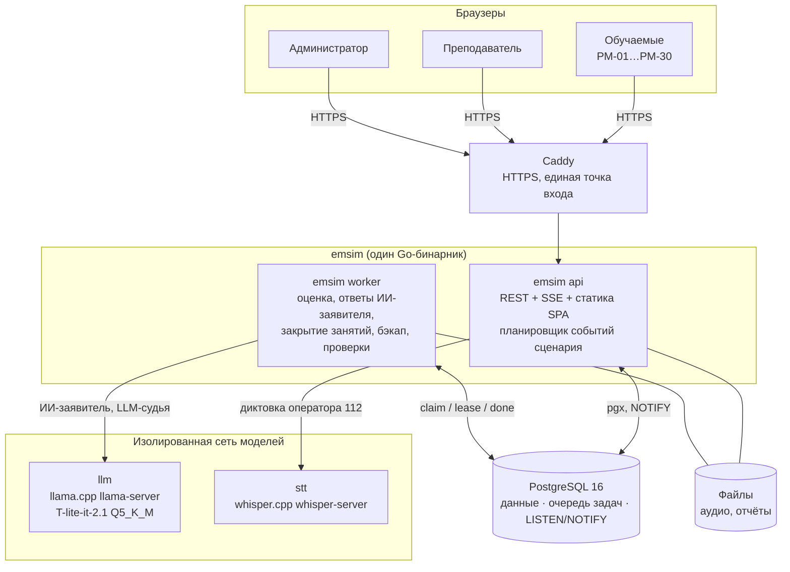
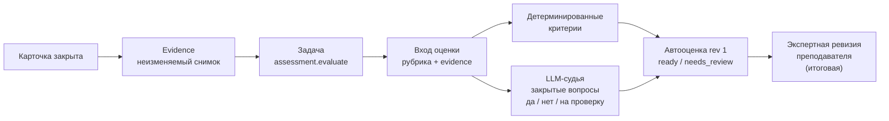

# EmSim — тренажёр диспетчеров экстренных служб

> Пояснительная записка к проекту. Документ для знакомства с системой: что это, как устроено, на чём написано, как развернуть и что реализовано.
> Подробности (обоснования решений, контракты, планы) — по ссылкам в разделе «Для углублённого чтения».

| | |
|---|---|
| Заказчик | ⟨УМЦ ГО ЧС / Департамент ГОЧСиПБ — уточнить формулировку⟩ |
| Команда | ⟨ФИО, роли⟩ |
| Репозиторий | https://github.com/DaleCoopTP/EmSim |
| Демо-стенд | ⟨ссылка⟩ |
| Видеодемонстрация | ⟨ссылка⟩ |
| Состояние на | 29.09.2026 |

## 1. Задача

Учебно-методический центр готовит диспетчеров, которые работают в АРМ-112 — системе приёма и обработки вызовов по номеру 112. Сейчас обучение идёт по бумажным билетам: без интерфейса, без контроля времени реакции и без объективной оценки.

EmSim — локальный веб-тренажёр, в котором группа из 20–30 курсантов одновременно отрабатывает происшествия в интерфейсе, повторяющем АРМ-112. Преподаватель готовит задания, наблюдает занятие в реальном времени и получает автоматическую оценку каждого прохождения, которую может исправить. Система работает полностью офлайн, на одном сервере без GPU.

В тренажёре два самостоятельных упражнения:

| Упражнение | Кто обучается | Что делает обучаемый |
|---|---|---|
| **Оператор 112** (`operator112_intake`) | оператор системы-112 | принимает входящий вызов, опрашивает заявителя (подготовленные вопросы или свободный диалог с ИИ-заявителем, в том числе голосом через диктовку), заполняет карточку происшествия и профильные опросные карты, проверяет список служб и оповещает их |
| **Диспетчер ДДС** (`dds_processing`) | диспетчер дежурно-диспетчерской службы (района, скорой помощи 03) | получает заполненную карточку от 112, в течение 30 с принимает или отклоняет её, связывается с бригадой, ведёт статусы реагирования с комментариями по докладам бригады («Начало реагирования» → «Прибытие» → «Проведение работ» → «Работы завершены» / «Отказ») |

У каждого упражнения свои сценарии, правила, рубрика оценки и отчёты; результаты ДДС и 112 никогда не смешиваются.

## 2. Роли и основные сценарии

| Роль | Что может |
|---|---|
| **Обучаемый** | входит с номером рабочего места (РМ); проходит назначенную очередь карточек; видит свою историю, результаты и прогресс |
| **Преподаватель** | ведёт каталог сценариев; создаёт сценарии 112 в веб-редакторе и проходит их сам в режиме предпросмотра; создаёт занятие, назначает очереди по РМ (вручную или случайной выборкой по категориям и уровню), настраивает нормативы и веса критериев; следит за занятием в live-мониторе, останавливает его; разбирает автооценку и исправляет её; получает отчёт по занятию (таблица, CSV, PDF) |
| **Администратор** | пользователи (в том числе пакетная загрузка CSV), рабочие места, состояние системы, журнал аудита, отчёты использования и сбоев, резервные копии, режим обслуживания, проверка целостности. Доступа к содержимому занятий и оценкам не имеет |

Типичное занятие:

1. Преподаватель создаёт занятие, назначает сценарии на РМ, запускает.
2. Обучаемые получают первые карточки; сервер ведёт таймеры нормативов, по таймлайну сценария приходят события (доклады бригады, входящие звонки, новые карточки).
3. Преподаватель видит в мониторе, кто на какой карточке, статусы, таймеры и последнее действие.
4. После закрытия карточки фоновый worker считает автооценку: детерминированные критерии и, где включено, проверку текста локальной LLM.
5. Преподаватель разбирает оценки, при несогласии исправляет (исправление становится итоговым, история сохраняется), выгружает отчёт.

## 3. Архитектура

### 3.1 Обзор

Модульный монолит на Go: один бинарник `emsim` с подкомандами `migrate`, `api`, `worker`, `bootstrap-admin`, `import` и служебными (`backup`, `restore`, `demo-setup`, `bench-llm`). PostgreSQL 16 хранит данные и одновременно служит очередью фоновых задач и шиной уведомлений. Веб-клиент (React SPA) встроен в бинарник и раздаётся тем же процессом `api`. Локальные модели (LLM и распознавание речи) — отдельные контейнеры в изолированной сети без выхода в интернет.



### 3.2 Модули

Код разделён на продуктовые модули с явными границами: модуль пишет только в свои таблицы, чужие данные читает через узкие интерфейсы, объявленные у потребителя. Циклических зависимостей нет.

| Модуль | Отвечает за |
|---|---|
| `auth` | пользователи, сессии, роли, рабочие места, политика входа |
| `content` | справочник служб и их workflow статусов, классификатор происшествий, сценарии и их неизменяемые версии, редактор сценариев 112 |
| `training` | занятия, назначения, прохождения, карточки, команды обучаемого, события по таймлайну, звонки, остановка, монитор. Правила упражнений — в `training/dds` и `training/operator112` |
| `assessment` | рубрики, конвейер автооценки, LLM-судьи, экспертные ревизии. Критерии — в `assessment/dds` и `assessment/operator112` |
| `reporting` | отчёты по занятию и по обучаемому, CSV, PDF, отчёты использования для администратора |
| `media` | аудиофайлы (записи, подготовленные реплики) |
| `platform` | очередь задач, SSE, аудит, HTTP, метрики, резервное копирование, проверка целостности, клиенты LLM и STT |

Сборка приложения из модулей — только в `cmd/emsim`.

### 3.3 Ключевые архитектурные решения

| Решение | Почему | ADR |
|---|---|---|
| Модульный монолит, один бинарник | один сервер, одна команда, нагрузка ~30 rps в пике; сеть между сервисами добавила бы только точки отказа | [001](../../design-docs/adr/001-modular-monolith-single-binary.md) |
| PostgreSQL как очередь и шина (`SKIP LOCKED`, `LISTEN/NOTIFY`) | не нужен Redis/RabbitMQ; доменное изменение и постановка задачи фиксируются в одной транзакции | [002](../../design-docs/adr/002-postgres-as-queue-and-bus.md) |
| LLM вне интерактивного пути | CPU-сервер без GPU; действия обучаемого не ждут модель. Узкие исключения: ответ ИИ-заявителя (асинхронная задача), LLM-судья после закрытия карточки, диктовка | [003](../../design-docs/adr/003-llm-outside-interactive-path.md), [025](../../design-docs/adr/025-operator112-ai-caller.md), [028](../../design-docs/adr/028-operator112-description-llm-judge.md), [037](../../design-docs/adr/037-operator112-dictation.md) |
| Сервер — источник истины, идемпотентный протокол команд | повтор команды после обрыва сети не даёт второго эффекта; порядок и время определяет сервер | [004](../../design-docs/adr/004-server-source-of-truth-command-protocol.md) |
| Симулятор телефона без SIP | реальная телефония не нужна для обучения и оценки | [005](../../design-docs/adr/005-phone-simulator-without-sip.md) |
| Неизменяемый снимок (evidence) и ревизии оценки | оценка воспроизводима; правка преподавателя не теряет историю | [006](../../design-docs/adr/006-evidence-snapshot-and-assessment-revisions.md) |
| SSE для push-уведомлений | двусторонний канал не нужен; обычный HTTP, автопереподключение | [007](../../design-docs/adr/007-sse-for-push.md) |
| Локальная модель в составе поставки | офлайн-работа, данные не покидают учебный центр | [029](../../design-docs/adr/029-operator112-local-inference-container.md) |

Полный список — 37 ADR в [`design-docs/adr/`](../../design-docs/adr/).

### 3.4 Команда обучаемого

Все действия обучаемого идут через один эндпоинт `POST /api/v1/items/{id}/actions` с телом `{command_id, expected_seq, type, payload}`. Сервер обрабатывает команду короткой транзакцией под блокировками занятия и карточки, записывает её в журнал и отвечает квитанцией. Повтор того же `command_id` возвращает исходную квитанцию без повторного эффекта; устаревший `expected_seq` отклоняется. Остановка занятия — барьер: действие либо попало в снимок до остановки, либо отклонено.

```mermaid
sequenceDiagram
    participant B as Браузер обучаемого
    participant API as emsim api
    participant DB as PostgreSQL
    B->>B: сохранить команду в localStorage
    B->>API: POST /items/{id}/actions {command_id, expected_seq, ...}
    API->>DB: BEGIN; lessons FOR SHARE; items FOR UPDATE
    alt command_id уже есть
        DB-->>API: исходная квитанция
    else новая команда
        API->>DB: проверить running, seq, правила упражнения
        API->>DB: INSERT actions; UPDATE items; audit; pg_notify
    end
    API->>DB: COMMIT
    API-->>B: квитанция {outcome, seq, item_state}
    DB-->>API: NOTIFY → SSE монитору преподавателя
```

### 3.5 Оценивание

После закрытия карточки в той же транзакции создаётся неизменяемый снимок прохождения (evidence) и ставится задача `assessment.evaluate`. Worker фиксирует вход оценки (снимок + действующая рубрика), затем вне транзакции задаёт закрытые вопросы LLM-судье (если он включён) и одной транзакцией записывает автооценку.



Принципы:

- Модель не ставит баллы. Она отвечает на закрытые вопросы по тексту (описание заявителя, комментарии к статусам); баллы считает backend по рубрике.
- Модели не передаются эталон и рубрика — только проверяемый текст и вопросы.
- Если модель недоступна или не уверена, оценка получает статус «требует проверки» без балла, а не ноль. Ручная оценка возможна всегда, без LLM.
- Рубрика фиксируется в занятии при создании; изменение рубрики не меняет уже проведённые занятия.

Действующие рубрики:

| Упражнение | Рубрика | Критерии |
|---|---|---|
| ДДС | `dds/rubric-v3` (с LLM-судьёй) / `v2` (без) | время открытия и первичного решения, правильность решения, реакция на доклады бригады в срок, последовательность статусов, обязательные комментарии, содержание комментариев (LLM), звонки, грамотность (LLM, справочно) |
| Оператор 112 | `operator112/rubric-v3` (с LLM-судьёй) / `v2` (без) | адрес, профильные карты, выясненные у заявителя темы, два временных блока, описание со слов заявителя (LLM по контрольным вопросам сценария) + штрафные критерии |

### 3.6 Надёжность

- Подтверждённые действия хранятся на сервере; одна неподтверждённая команда на карточку переживает перезагрузку вкладки (localStorage) и повторяется с тем же `command_id`.
- SSE — только уведомление; после переподключения клиент перечитывает состояние из API.
- Задачи выполняются at-least-once с fencing-токенами и lease по часам PostgreSQL; доменный результат фиксируется ровно один раз.
- При перезапуске сервера незакрытые карточки получают отметку прерывания; их временные критерии не оцениваются.
- Ежедневная резервная копия (БД + файлы) с контрольными суммами, ежедневная проверка целостности, журнал аудита каждого изменения.

## 4. Стек

| Слой | Технологии |
|---|---|
| Backend | Go 1.26, стандартная библиотека `net/http`, `pgx/v5`, `goose` (миграции), `argon2id` (пароли), `jsonschema` (валидация сценариев), `fpdf` (PDF-отчёты), Prometheus client |
| База данных | PostgreSQL 16 — данные, очередь задач, `LISTEN/NOTIFY` |
| Frontend | TypeScript, React 18, React Router, TanStack Query, Vite; без UI-кита, стили повторяют АРМ-112; типы API генерируются из OpenAPI (`openapi-typescript`) |
| LLM | `llama.cpp` (`llama-server`, OpenAI-совместимый API), модель T-lite-it-2.1 (8B, GGUF Q5_K_M); поддерживается удалённый OpenAI-совместимый API |
| Распознавание речи | `whisper.cpp` (`whisper-server`), модель `ggml-small` |
| Инфраструктура | Docker Compose, Caddy (HTTPS: внутренний CA для класса или Let's Encrypt для публичного стенда) |
| Наблюдаемость | JSON-логи `slog`, метрики Prometheus, `/healthz`, `/readyz`, экран «Состояние» |
| Тестирование | Go unit-тесты, интеграционные тесты на реальном PostgreSQL (testcontainers), Playwright e2e, проверка контрактов (Python) |

## 5. Развёртывание

### 5.1 Требования

- Docker с Compose v2.
- Целевой сервер класса: 6 ядер CPU, 32 ГБ ОЗУ, GPU не нужен. Для локальной демонстрации без модели хватит обычного ноутбука.
- Интернет нужен только один раз — чтобы собрать образы и скачать веса моделей. Дальше система работает офлайн.

### 5.2 Быстрый запуск (демо на одной машине)

```bash
git clone https://github.com/DaleCoopTP/EmSim.git && cd EmSim
cp .env.example .env        # сменить пароль администратора
make model                  # веса LLM в ./models (один раз, ~5,4 ГБ)
make stt-model              # модель распознавания речи (один раз, ~465 МБ)
docker compose up --build
```

Без моделей (быстрая проверка интерфейса; ИИ-заявитель заменяется заглушкой, LLM-судья выключен):

```bash
docker compose -f compose.yaml -f compose.no-llm.yaml up --build
```

Compose поднимает PostgreSQL, применяет миграции, создаёт администратора, загружает каталог служб и сценариев из `seed/`, запускает `api`, `worker` и модели. Приложение — `http://localhost:8080`.

Демо-пользователи (преподаватель и по обучаемому на РМ):

```bash
DEMO_PASSWORD=<пароль> make demo
```

Создаются `instructor`, `trainee01…trainee06` и рабочие места `РМ-01…РМ-06`.

### 5.3 Сервер класса (HTTPS в локальной сети)

```bash
# в .env: EMSIM_HOST=emsim.local, 192.168.10.5
make class-up               # Caddy с внутренним CA перед api
make class-ca               # корневой сертификат → установить на ПК класса
```

На рабочих местах открыть `https://<EMSIM_HOST>/`. HTTPS нужен в том числе для доступа браузера к микрофону (диктовка).

Публичный стенд с сертификатом Let's Encrypt — `make public-up` (нужны DNS-имя и открытые порты 80/443).

### 5.4 Эксплуатация

| Задача | Как |
|---|---|
| Резервная копия | автоматически ежедневно в 03:00 (14 копий); вручную — кнопка на «Состоянии» или `docker compose run --rm --no-deps worker backup` |
| Восстановление | `scripts/restore.sh backups/<копия>` (предварительно делает страховочную копию) |
| Обновление | режим обслуживания на «Состоянии» → `scripts/update.sh` (обязательная копия перед обновлением) |
| Офлайн-пакет | `make release-bundle` — образы, compose-файлы и скрипты; веса моделей переносятся отдельно |
| Удалённая модель вместо локальной | `compose.remote-llm.yaml`, переменные `REMOTE_LLM_URL`, `REMOTE_LLM_MODEL`, `LLM_API_KEY` |

Полная инструкция со всеми переменными — корневой [`README.md`](../../README.md).

## 6. API

REST/JSON с префиксом `/api/v1`, сессия в cookie (`HttpOnly`, `SameSite=Strict`, `Secure` за HTTPS), push-уведомления через SSE. Ошибки — единый формат `{"error": {"code", "message", "details"}, "request_id"}` с закрытым списком кодов.

Контракт: [`design-docs/contracts/openapi.yaml`](../../design-docs/contracts/openapi.yaml) (OpenAPI 3). В контракте 70 путей, реализовано 62; остальные 8 относятся к запланированным возможностям (генерация сценариев LLM, импорт классификатора через веб, рекомендация уровня, групповой прогресс).

| Группа | Основные пути | Роль |
|---|---|---|
| Аутентификация | `POST /auth/login`, `POST /auth/logout`, `GET /me`, `POST /me/password` | все |
| Сценарии | `GET/POST /scenarios`, `GET/PUT /scenarios/{id}`, `/versions`, `/validate`, `/approve`, `/preview-runs`, `GET /scenarios/categories` | преподаватель |
| Занятия | `POST /lessons`, `PATCH /lessons/{id}`, `PUT /lessons/{id}/assignments`, `POST .../assignments/draw`, `POST .../start`, `POST .../stop`, `GET .../monitor`, `GET .../stream` (SSE) | преподаватель |
| Рабочее место обучаемого | `GET /my/run`, `GET /my/items`, `GET /items/{id}`, `POST /items/{id}/actions`, `POST /items/{id}/dictation`, `GET /my/stream` (SSE) | обучаемый |
| Оценка | `GET /items/{id}/assessment`, `POST /items/{id}/assessment/revisions`, `GET /lessons/{id}/assessments` | преподаватель (обучаемый — свой результат без эталона) |
| Результаты и отчёты | `GET /my/results`, `GET /my/progress`, `GET /lessons/{id}/report`, `.csv`, `.pdf` | обучаемый / преподаватель |
| Администрирование | `/admin/users`, `/admin/users/import`, `/admin/workstations`, `/admin/status`, `/admin/audit`, `/admin/usage`, `/admin/failures`, `/admin/config`, `/admin/maintenance`, `/admin/backup`, `/admin/integrity`, `/admin/tasks/{id}/retry` | администратор |

Все действия обучаемого на карточке — команды одного эндпоинта `POST /items/{id}/actions` (см. §3.4). Например, для ДДС — `open`, `set_status`, `call_start`, `call_end`, `answer_incoming`; для 112 — `answer_incoming`, `ask_intake_question`, `send_caller_message`, `save_intake_draft`, `add_incident_type`, `notify_services`.

Кроме OpenAPI, в [`design-docs/contracts/`](../../design-docs/contracts/) лежат JSON-схемы сценария, evidence, входа оценки, событий SSE, рубрик и DDL базы.

## 7. Что реализовано

**Оператор 112**
- Входящий вызов, карточка с нуля, основная форма.
- Уточняющий опрос заявителя по подготовленным вопросам; условия раскрытия фактов.
- Типы происшествия, профильные опросные карты 104 (газ) и 101 (пожар), автоматический подбор служб.
- Единый финал «Оповестить и сохранить» со снимком отправленной карточки.
- Свободный диалог с ИИ-заявителем в окне чата (локальная LLM, асинхронный ответ, прогрев кэша промпта).
- Диктовка реплик оператора голосом (whisper.cpp).
- Автооценка по 100-балльной рубрике; LLM-судья описания заявителя.
- Веб-редактор сценариев с проверкой и предпросмотром «пройти самому».

**Диспетчер ДДС**
- Цикл статусов реагирования через «карандаш» по памятке ДДС; финальный статус закрывает карточку.
- Связь с бригадой: исходящие и входящие звонки, доклады бригады по таймлайну сценария.
- Рубрика с реакцией на доклады и последовательностью статусов; LLM-судья содержания и грамотности комментариев.
- Настройка занятия: нормативы времени, веса критериев и порог, случайная выдача по категориям и уровню.

**Общее**
- Занятия, очереди по РМ, live-монитор, остановка, восстановление после перезапуска.
- Экспертные ревизии оценки, отчёты по занятию (JSON, CSV, PDF), история и прогресс обучаемого.
- Роль администратора, резервные копии, проверка целостности, режим обслуживания, профили развёртывания.
- Каталог: 49 файлов сценариев (ДДС района, ДДС 03, оператор 112), построенных по памяткам и инструкциям заказчика.

**Качество:** ⟨96⟩ пакетов unit-тестов, ⟨52⟩ интеграционных тестов на реальном PostgreSQL, ⟨15⟩ e2e-сценариев в браузере (Playwright), автоматическая проверка контрактов. ⟨цифры — число файлов, при желании заменить на число тестов⟩

## 8. Ограничения и дальнейшие планы

Честно о том, что ещё не сделано:

- **Не измерено** на целевом сервере, сколько одновременных диалогов с ИИ-заявителем и распознаваний речи выдержит класс (замер W0). Параметры по умолчанию выбраны до замера.
- Живой замер точности LLM-судьи комментариев ДДС на модели не проведён.
- Карты 104/101, правила подбора служб и рубрики ждут профильной приёмки экспертом.
- В планах: озвучка заявителя и голосовой звонок (112), взаимодействие 112 ↔ ДДС, реальный классификатор и расширенный набор сценариев ДДС, рекомендация уровня и графики, редактор и LLM-генерация сценариев ДДС, ознакомительный режим, нагрузочный прогон, офлайн-пакет с моделями.

## 9. Для углублённого чтения

| Документ | Что в нём |
|---|---|
| [`design-docs/rfc-001-emsim.md`](../../design-docs/rfc-001-emsim.md) | исходный технический дизайн: use cases, модель данных, критические потоки, отказоустойчивость, безопасность, capacity, альтернативы |
| [`design-docs/adr/`](../../design-docs/adr/) | 37 архитектурных решений: контекст, варианты, последствия |
| [`design-docs/contracts/`](../../design-docs/contracts/) | OpenAPI, DDL, JSON-схемы, рубрики |
| [`design-docs/diagrams/`](../../design-docs/diagrams/) | компоненты, последовательности, ER-диаграмма |
| [`slice-planning-112.md`](../../slice-planning-112.md), [`slice-planning-dds.md`](../../slice-planning-dds.md) | план поставки по вертикальным срезам и статус каждого |
| [`README.md`](../../README.md) | полная инструкция по запуску и эксплуатации |
| [`seed/README.md`](../../seed/README.md) | формат и состав сценариев |
